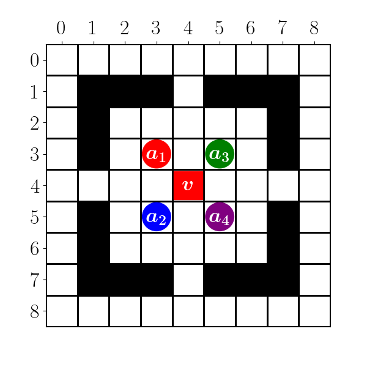

# MAPF Map Drawer
This is a simple tool to draw maps for Multi-Agent Path Finding (MAPF) problems. It is written in Python and uses the Matplotlib library to draw the maps.

## Usage
Edit the `map.csv` file to create your map. The file should contain a matrix of characters, where each character represents a different type of cell. The following characters are supported:
- `0`(or Any): Empty cell
- `1`: Obstacle

And edit the `map_info.yaml` file to show the agents and goals.

Run the `main.py` file to draw the map, and save it as a PNG file.

## Sample Image
